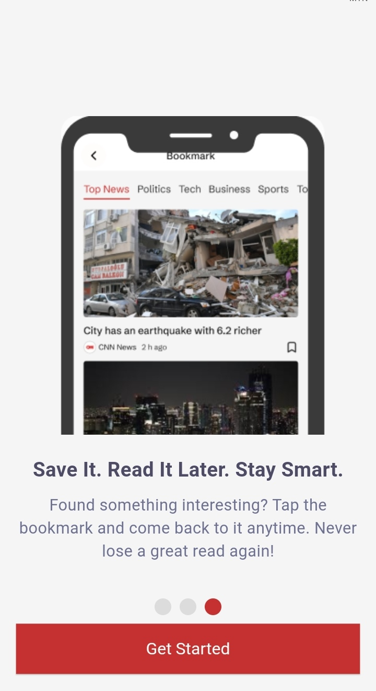
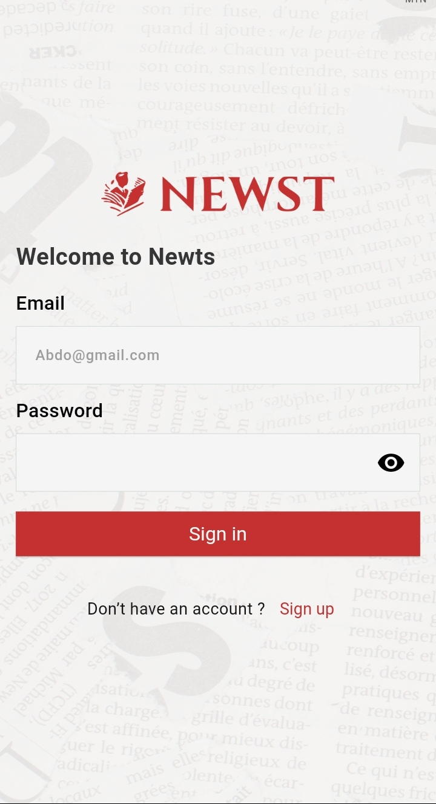
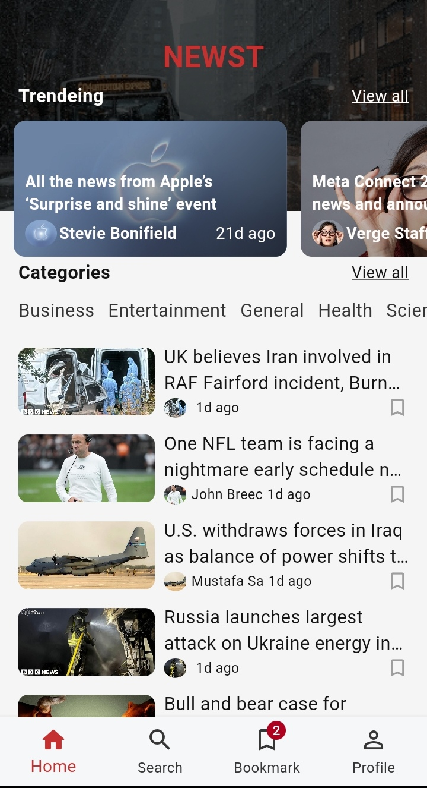
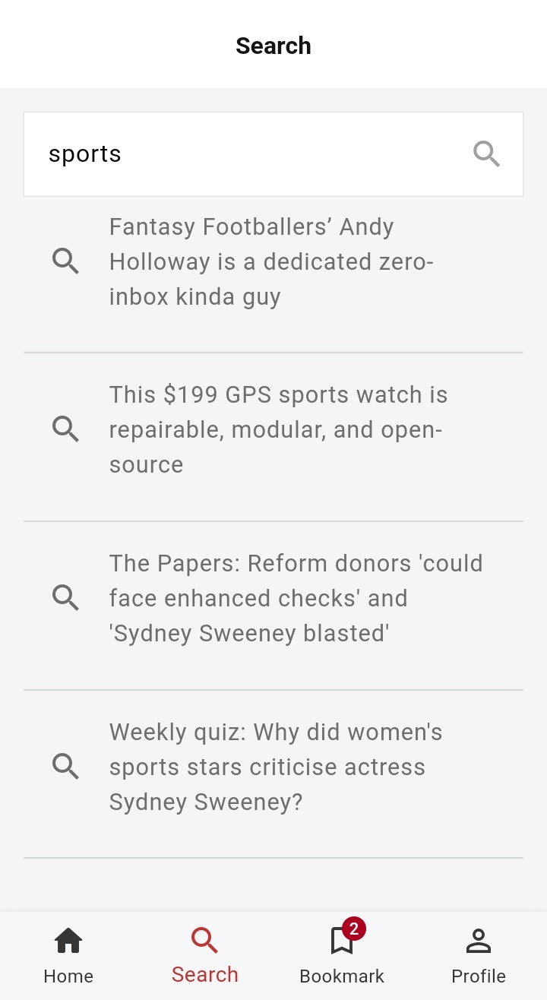
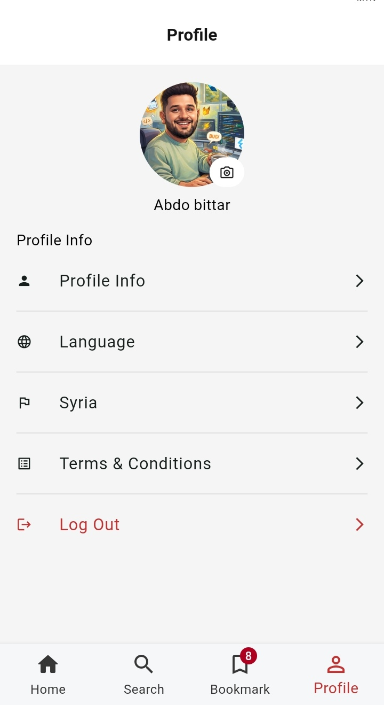

# News App

A modern and responsive Flutter news application that retrieves news articles from external REST APIs and allows users to browse, search, and save their favorite news.

The application is built using Clean Architecture and the Repository Pattern, with Cubit for state management and Hive for local data storage.

---

## Features

- Onboarding experience for new users.
- API-based user login.
- Browse trending news.
- Browse news by categories such as Sports, Entertainment, General, Health, and more.
- View complete news articles through a dedicated News Details screen.
- Search for news directly through the external API.
- Save news articles to bookmarks.
- Store bookmarked articles locally using Hive.
- View and edit user profile information.
- Update profile image using Image Picker.
- Country selection using Country Picker.
- Logout functionality.
- Responsive UI for different mobile screen sizes.
- Shimmer loading effects.
- Cached network images.
- API error handling.
- Reusable shared widgets.

---

## Screenshots

| Onboarding | Login |
|------------|-------|
|  |  |

| Home | Search |
|------|--------|
|  |  |

| Bookmark | Profile |
|----------|---------|
|  |  |

---

## Tech Stack

- Flutter
- Dart
- Cubit / Flutter BLoC
- Dio
- HTTP
- REST APIs
- Hive
- SharedPreferences
- Clean Architecture
- Repository Pattern
- Equatable
- Responsive Design
- Figma

---

## API & Networking

The application communicates with external REST APIs to retrieve news and handle user authentication.

### Networking

- **Dio** for API communication.
- **HTTP** for HTTP requests.
- **Dio Interceptors** for centralized request and response handling.
- Error handling for API requests, responses, and unexpected data.

---

## State Management

The application uses **Cubit** for state management, keeping business logic separate from the UI and providing predictable state updates.

---

## Local Storage

The application uses local storage to persist user-related data and bookmarked news.

- **Hive** – Stores bookmarked news articles and local user data.
- **SharedPreferences** – Used for storing application preferences and lightweight local data.

---

## Architecture

The project follows **Clean Architecture** and the **Repository Pattern** to separate responsibilities and improve maintainability.

The project is organized using a feature-based structure:

```text
lib/
├── core/
│   ├── datasource/
│   ├── enums/
│   ├── extensions/
│   ├── light_theme/
│   ├── mixins/
│   ├── models/
│   ├── repository/
│   └── shared_widget/
│
├── features/
│   ├── auth/
│   ├── bookmark/
│   ├── details/
│   ├── home/
│   ├── home_layout/
│   ├── onboarding/
│   ├── profile/
│   ├── search/
│   └── splash/
│
├── hive_register.g.dart
└── main.dart
```
---

## UI & Design

The user interface was designed using Figma and implemented in Flutter with a focus on:

-Clean and intuitive layouts.
-Responsive design.
-Reusable widgets.
-Consistent UI components.
-Smooth loading states.

##  Getting Started
Prerequisites

Make sure you have Flutter installed on your machine.

Installation

```bash
git clone https://github.com/abdobittar99/news_app.git

cd news_app

flutter pub get

flutter run

```

## Project Structure

The application follows a feature-based structure where each major functionality is organized independently, while common functionality is placed inside the core directory.

## Author

**Abdalrahman Bittar**

- GitHub: https://github.com/abdobittar99
- Email: abdo.bittar79@gmail.com

